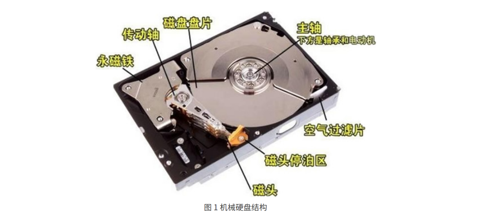
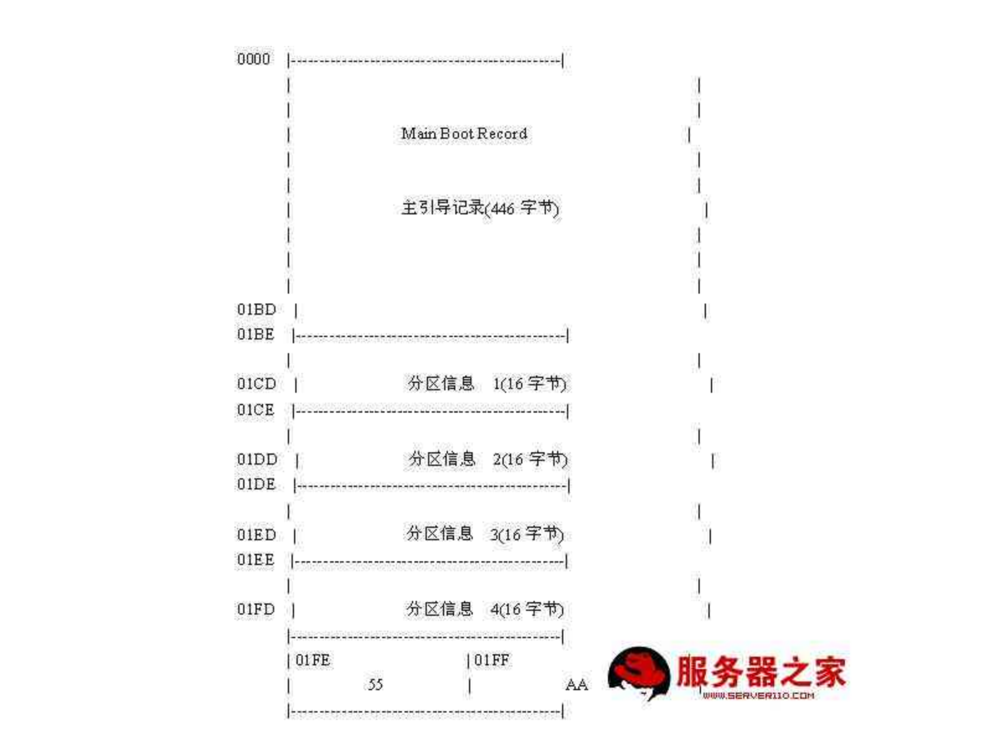

## 硬盘的物理结构


#### 机械硬盘(HDD)



**磁道**: 每个盘片都在逻辑上有很多的同心圆，最外面的同心圆就是 0 磁道。我们将每个同心圆称作磁道（注意，磁道只是逻辑结构，在盘面上并没有真正的同心圆）。硬盘的磁道密度非常高，通常一面上就有上千个磁道。但是相邻的磁道之间并不是紧挨着的，这是因为磁化单元相隔太近会相互产生影响。

**扇区:** 在磁盘上每个同心圆是磁道，从圆心向外呈放射状地产生分割线（扇骨），将每个磁道等分为若干弧段，每个弧段就是一个扇区。每个扇区的大小是固定的，为 512Byte。扇区也是磁盘的最小存储单位。

**柱面:** 不同盘面同一磁道组成的圆柱面.


## 硬盘逻辑结构

#### **主引导扇区**

主引导扇区位于硬盘的0磁道0柱面1扇区, 共512bytes,由三大部分组成:

1. 硬盘主引导记录MBR(Master Boot Record) 占用446bytes

   > 计算机启动时BIOS会查询此部分判断启动计算机的方式

2. 分区表DPT(Disk Partition Table) 占用64bytes:

   > 每个分区信息为16bytes, 所以一个硬盘最多只能有4个主分区.
   >
   > 为了实现更多分区,可以在四个分区信息块创建逻辑分区,通过扩展分区定义可定义更多逻辑分区.

3. 硬盘有效标志 (Major Number) 占用2bytes



#### 文件系统


**元数据存储区**

Inode: Inode储存文件的元信息,包括:

-  文件的字节数
- 文件拥有者的User ID
- 文件的Group ID
- 文件的读、写、执行权限
- 文件的时间戳，共有三个：ctime指inode上一次变动的时间，mtime指文件内容上一次变动的时间，atime指文件上一次打开的时间。
- 链接数，即有多少文件名指向这个inode
- 文件数据block的位置

Inode 不会去

**数据存储区**


#### Linux重要文件夹: 

https://www.cnblogs.com/nul1/p/8455224.html


### df

**查看硬盘信息:** 

|   Size   |    Used    |  Avail   |   Use%   | Mounted on |
| :------: | :--------: | :------: | :------: | :--------: |
| 磁盘大小 | 已使用容量 | 可用容量 | 使用比例 |   挂载点   |

- 可用容量与已使用容量的和小于磁盘总容量的原因是要预留给管理员的磁盘空间(即便用户空间已满)
- Mounted on指挂载点, 类似于windows系统的盘符,不过是以文件夹形式表示.
- 输出清单的第一列"FileSystem"代表文件系统对应的设备文件的路径名.

**指令后缀**

- -h 以方便阅读的形式显示 -H功能相同,不过转换的单位是1000而不是1024.
- -m, -k 以MB为区块单位显示或者以KB为区块单位显示.
- -i 显示inode信息
- -T 显示文件系统类型
- -block-size <区块大小> 指定区块的大小
- -t <文件系统类型> 只显示指定的文件系统类型  -x <文件系统类型> 不显示指定的文件系统类型
  <br>

## lsblk

**lsblk命令用来查看block设备的信息**

> 块设备文件是块设备的物理寻址空间,普通文件是块设备的虚拟寻址空间. 普通文件比块设备文件多一层文件系统的地址转换结构 。

- NAME : 块设备名。
- MAJ:MIN : 本栏显示主要和次要设备号。
- RM : 本栏显示设备是否可移动设备。注意，在本例中设备sdb和sr0的RM值等于1，这说明他们是可移动设备。
- SIZE : 本栏列出设备的容量大小信息。例如298.1G表明该设备大小为298.1GB，而1K表明该设备大小为1KB。
- RO : 该项表明设备是否为只读。在本案例中，所有设备的RO值为0，表明他们不是只读的。
- TYPE :本栏显示块设备是否是磁盘或磁盘上的一个分区。
- MOUNTPOINT : 本栏指出设备挂载的挂载点。

**指令后缀:**

```
 -a, --all            print all devices
 -b, --bytes          print SIZE in bytes rather than in human readable format
 -d, --nodeps         don't print slaves or holders
 -D, --discard        print discard capabilities
 -e, --exclude <list> exclude devices by major number (default: RAM disks)
 -f, --fs             output info about filesystems
 -i, --ascii          use ascii characters only
 -I, --include <list> show only devices with specified major numbers
 -J, --json           use JSON output format
 -l, --list           use list format output
 -m, --perms          output info about permissions
 -n, --noheadings     don't print headings
 -o, --output <list>  output columns
 -O, --output-all     output all columns
 -p, --paths          print complete device path
 -P, --pairs          use key="value" output format
 -r, --raw            use raw output format
 -s, --inverse        inverse dependencies
 -S, --scsi           output info about SCSI devices
 -t, --topology       output info about topology
 -x, --sort <column>  sort output by <column>

 -h, --help     display this help and exit
 -V, --version  output version information and exit
```


### blkid

**blkid主要用来对系统的块设备（包括交换分区）所使用的文件系统类型、LABEL、UUID等信息进行查询。**

- UUID: Unversally Unique Identifier (通用唯一识别码) 由32位数的16进制数字所构成(128bits). UUID保证当硬盘中增加了新的分区，或者分区的顺序改变后，仍然能够保证系统加载分区到正确的加载点。
- LABEL: 分区的别名


### stat

**stat命令主要用于显示文件或文件系统的详细信息** (即查看文件的Inode信息)	

- -f  不显示文件本身的信息，显示文件所在文件系统的信息 
- -Z  打印SElinux安全上下文信息 
- -L  显示符号链接 
- -c  自定义输出格式，结尾有换行 
- -t   简洁模式，只显示摘要信息

