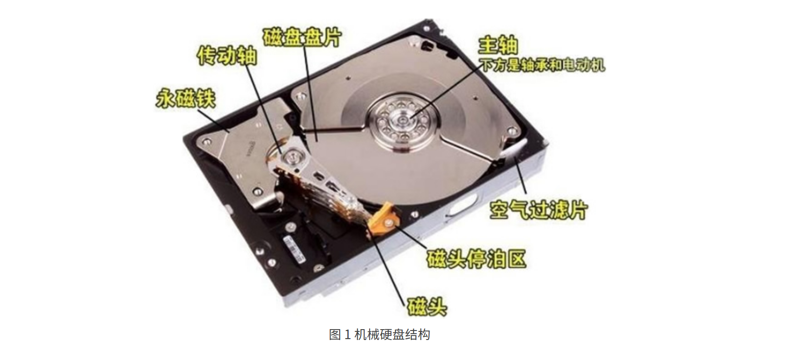
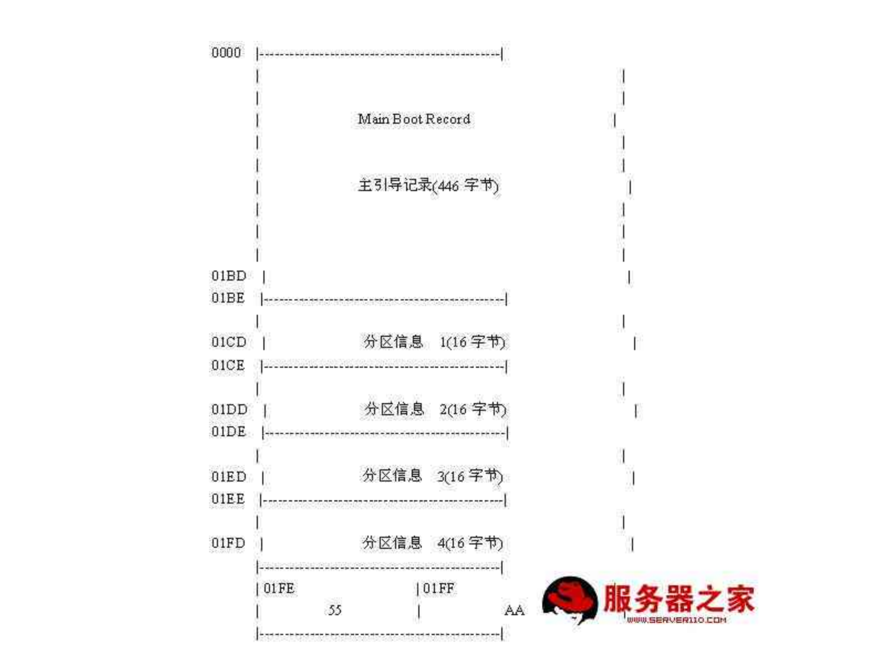

## 硬盘的物理结构

#### 机械硬盘(HDD)

**磁道**: 每个盘片都在逻辑上有很多的同心圆，最外面的同心圆就是 0 磁道。我们将每个同心圆称作磁道（注意，磁道只是逻辑结构，在盘面上并没有真正的同心圆）。硬盘的磁道密度非常高，通常一面上就有上千个磁道。但是相邻的磁道之间并不是紧挨着的，这是因为磁化单元相隔太近会相互产生影响。

**扇区:** 在磁盘上每个同心圆是磁道，从圆心向外呈放射状地产生分割线（扇骨），将每个磁道等分为若干弧段，每个弧段就是一个扇区。每个扇区的大小是固定的，为 512Byte。扇区也是磁盘的最小存储单位。

**柱面:** 不同盘面同一磁道组成的圆柱面.

## 硬盘逻辑结构

#### **主引导扇区**

主引导扇区位于硬盘的0磁道0柱面1扇区, 共512bytes,由三大部分组成:

1. 硬盘主引导记录MBR(Master Boot Record) 占用446bytes

   > 计算机启动时BIOS会查询此部分判断启动计算机的方式

2. 分区表DPT(Disk Partition Table) 占用64bytes:

   > 每个分区信息为16bytes, 所以一个硬盘最多只能有4个主分区.
   >
   > 为了实现更多分区,可以在四个分区信息块创建逻辑分区,通过扩展分区定义可定义更多逻辑分区.

3. 硬盘有效标志 (Major Number) 占用2bytes

#### 文件系统

**元数据存储区**

Inode: Inode储存文件的元信息,包括:

-  文件的字节数
- 文件拥有者的User ID
- 文件的Group ID
- 文件的读、写、执行权限
- 文件的时间戳，共有三个：ctime指inode上一次变动的时间，mtime指文件内容上一次变动的时间，atime指文件上一次打开的时间。
- 链接数，即有多少文件名指向这个inode
- 文件数据block的位置

Inode 不会去

**数据存储区**

#### Linux重要文件夹: 

https://www.cnblogs.com/nul1/p/8455224.html

